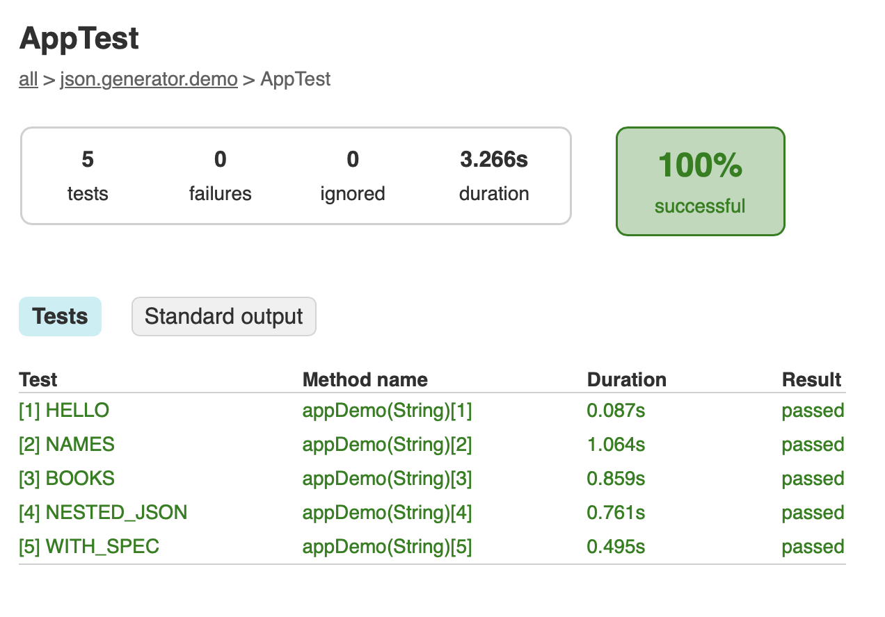
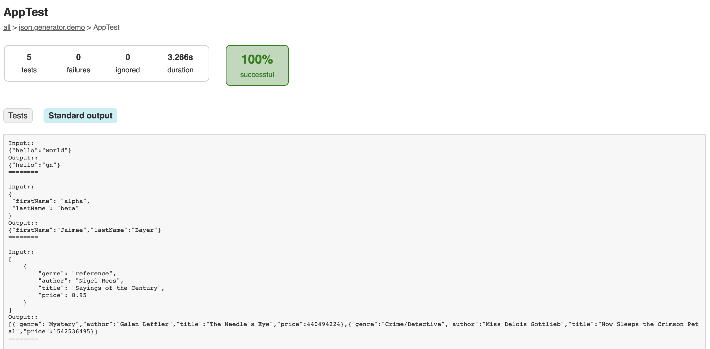

= Json Generator Demo

This repo shows how to add json-generator library (link:https://github.com/psumiya/json-generator[view GitHub repo]) as a dependency in a project.

`json-generator` is published as a github package, and not to Maven Central, so the steps are slightly different.

== Run this Project

This project is set up using Gradle 7.6 and JDK 19.

Clone the project, then run `./gradlew clean build` at the root.

Then you can see some sample generated json strings emitted by tests at the following location: build/reports/tests/test/classes/json.generator.demo.AppTest.html

The report looks like this.

See link:app/build.gradle[build.gradle] file for how to add the dependency.

You will need to use your GitHub user and a personal access token on your system to build this project. The token is used by build gradle script to download the dependency from github, as documented here regarding link:https://docs.github.com/en/packages/working-with-a-github-packages-registry/working-with-the-gradle-registry#using-a-published-package[Using a published package] from GitHub Packages Gradle Registry.
